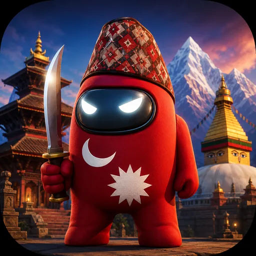
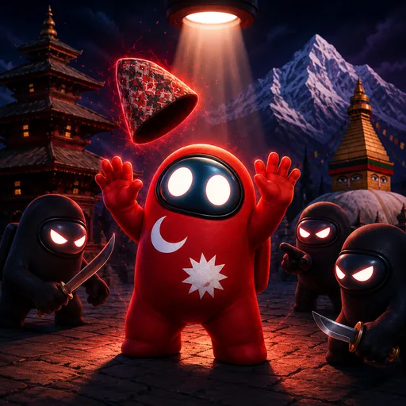

# नेपाली इम्पोस्टर खेल

### धोकेबाज हौ तिमी?

A party-game spin on Spyfall, in Nepali. Pass-and-play on one phone — find the imposter, or be the imposter and bluff your way through.

**[▶ Play it →](https://kshitizfrompali.github.io/nepali-imposter-game/)**

---

## Two ways to play

### 🎭 Classic
One player is the imposter. They don't know the secret word. Everyone else discusses, drops clues, asks questions — and tries to spot who's bluffing.

### 🐺 Word Wolf
Everyone gets a word. **One wolf** sees a slightly different word from the same theme — and they don't even know they're the wolf. Spot the player describing things slightly off-key.

---

## Why it's fun

- **18 themed categories** — politicians, celebrities, cricketers, food, festivals, places (all 77 districts), social media slang, and more
- **All Nepali, all local** — words and names that actually feel like home
- **Party-ready** — a single phone, 3+ players, no internet needed once loaded
- **Imposter-bias starter spin** — the bottle that picks who speaks first quietly skews away from the imposter, so they don't have to talk first

---

Built for Nepali game nights. Pull up a chiya and play.

